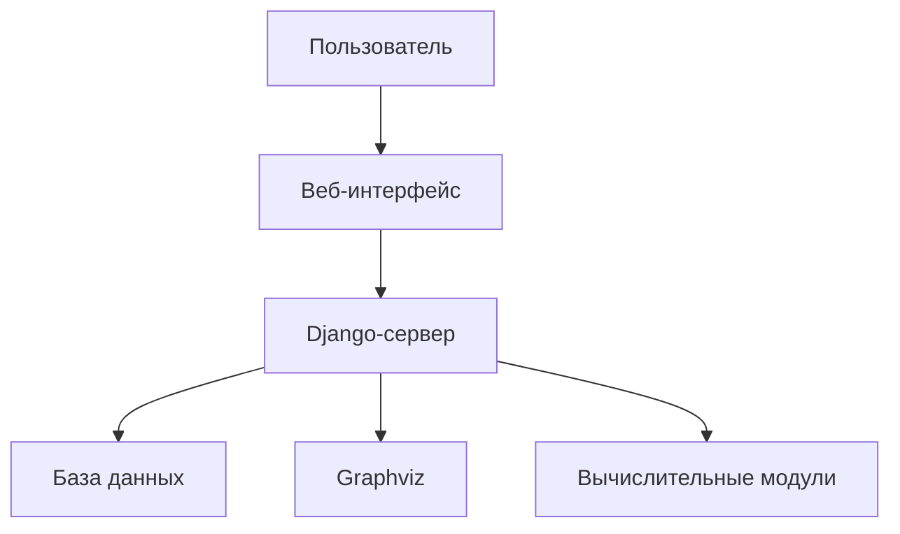
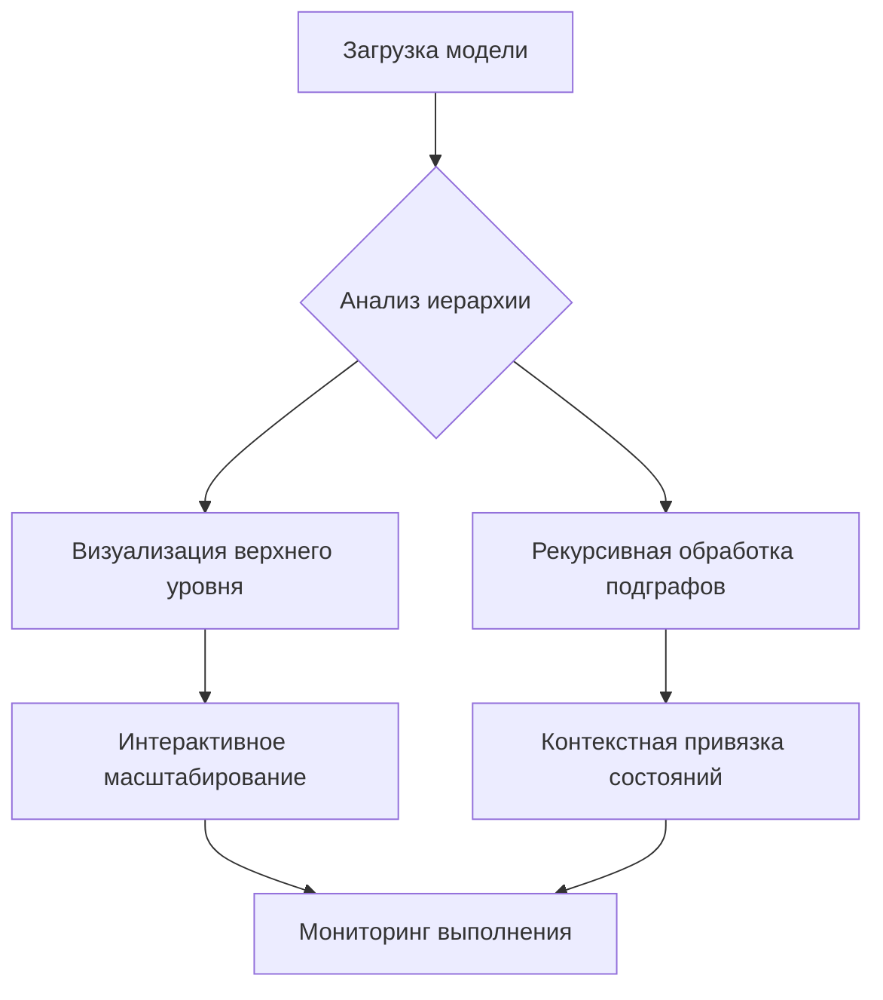

# FSFN-2024-008З - Подготовка статьи

## Атрибуты статьи

**Авторы**: Бобров С.А., Соколов А.П.
**Тема**: Интерактивная визуализация вычислительных процессов (ВП), описываемых графовыми моделями.

## Структура статьи
1. Введение
2. Теоретические основы графовых моделей ВП
3. Архитектура системы визуализации
4. Алгоритмы обработки иерархий
5. Реализация веб-интерфейса
6. Кейсы применения
7. Сравнительный анализ
8. Перспективы развития


## 1. Введение

> Рассказать об известных способах визуализации ВП. 

Современные сложные вычислительные методы (СВМ), используемые в научных исследованиях,
инженерных расчетах и системах автоматизированного проектирования (САПР),
характеризуются высокой структурной сложностью, наличием параллельных ветвей,
итеративных циклов и вложенных подзадач. Эффективная разработка, верификация и поддержка 
таких методов требуют не только обеспечения вычислительной точности и производительности,
но и высокой степени **понятности** и **прослеживаемости** вычислительного процесса для 
разработчика и конечного пользователя. 

Отсутствие системного подхода к организации научного кода приводит к возникновению 
ненаблюдаемых вычислительных процессов, характеризующихся:
1. Внутренняя логика вычислений становится непрозрачной
2. Затрудняется анализ и модификация алгоритмов
3. Возникает необоснованное доверие к результатам расчетов
4. Увеличиваются временные затраты на верификацию и валидацию

Особенно остро эта проблема проявляется в таких областях, как:
- Микромеханика композиционных материалов (прямая/обратная гомогенизация)
- Конечно-элементный анализ (МКЭ)
- Многомасштабное моделирование
- Проектирование гетерогенных материалов

**Графоориентированный подход как фундаментальное решение**  
В работе [1] предложен инновационный подход к структурированию СВМ через **графовые модели**,
где:

- **Вычислительные процессы (ВП)** представляют собой фундаментальную концепцию в области компьютерных наук
и системного моделирования, описывающую последовательность операций, выполняемых для достижения
конкретной цели. По своей природе ВП могут быть формализованы как **графовые модели**, где:  
- **Узлы** соответствуют состояниям системы или выполняемым операциям  
- **Рёбра** отражают переходы между состояниями или зависимость операций  
- **Иерархии** позволяют абстрагировать сложные подпроцессы через вложенные подграфы  
```plaintext
Узлы ≡ Состояния данных (S ∈ 𝒮)
Рёбра ≡ Функции перехода ⟨p, f⟩
```
Ключевые преимущества:
1. **Самодокументируемость**:
   - Явное описание эволюции состояний данных
   - Иерархическая вложенность подграфов (Рис. 3 в [1])

2. **Параллелизм**:
   - Копроизведение состояний (Определение 2.6)
   - Стратегии распараллеливания ("all or nothing", "only one")

3. **Обработка исключений**:
   - Функции-предикаты p : D → {0,1}
   - Тернарный оператор ⟨p, f⟩(D_m) = p(D_m) ? f(D_m) : D_m

**Проблемный пробел**  
Несмотря на концептуальную завершенность графоориентированного подхода, существующие 
реализации (включая каркас comsdk [1]) имеют существенное ограничение: 
**отсутствие инструментов динамической визуализации** выполнения вычислительных процессов.
Это приводит к:

1. **Трудностям мониторинга**:
   - Невозможность определения текущего состояния системы
   - Слепые зоны в параллельных ветвях
   - Отсутствие визуализации потоков данных

2. **Проблемам отладки**:
   - Ручной анализ логов для идентификации сбоев
   - Сложность трассировки ошибок в иерархических моделях
   - Отсутствие инструментов инспекции данных в runtime

3. **Ограниченной аналитике**:
   - Недоступность метрик производительности в реальном времени
   - Сложность оптимизации ресурсоемких участков
   - Отсутствие истории преобразования данных

Разработка системы интерактивной визуализации вычислительных 
процессов, описываемых графовыми моделями, обеспечивает:

1. **Динамическую трассировку**(? хочеться, но нужно ли):
   - Визуализацию активных узлов/ребер
   - Анимацию потоков данных
   - Подсветку ошибочных состояний

2. **Иерархическую навигацию**:
   - Интерактивное раскрытие подграфов
   - Модальную детализацию состояний
   - Контекстно-зависимую визуализацию

3. **Интеграцию с runtime**:
   - Подключение к вычислительным модулям C++
   - "Горячую" замену компонентов
   - Экспорт в формат (aDOT)

Такое представление обеспечивает мощный инструмент для проектирования, анализа и оптимизации сложных
систем.  

---

### 2. Теоретические основы графовых моделей вычислительных процессов

#### 2.1 Категориальный фундамент вычислительных процессов

Основой предлагаемого подхода является **категория состояний сложного вычислительного метода (СВМ)** с копроизведением, введенная Соколовым и Першиным [1]. Формально категория состояний 𝒞 определяется как:

1. **Объекты**: Состояния СВМ S ∈ 𝒮
   ```math
   𝒮 = \{ S_i \subset W \mid \forall s_1, s_2 \in S_i: s_1 \neq s_2 \Rightarrow pr_1(s_1) \neq pr_1(s_2) \}
   ```
   где W - множество элементарных состояний:
   ```math
   W = \text{Ind}(String) \times \prod_{i=0}^{NT} \text{Ind}(T_i)
   ```

2. **Морфизмы**: Функции перехода ⟨p, f⟩
   ```math
   f: \prod pr_2(s_{in}) \rightarrow \prod pr_2(s_{out})
   ```
   с функцией-предикатом p: D → {0,1}

3. **Композиция**: Ассоциативная операция последовательного применения:
   ```math
   (f_2 \circ f_1)(D) = f_2(f_1(D))
   ```

4. **Копроизведение**: Объединение параллельных состояний:
   ```math
   S = S_1 \sqcup S_2 \quad \text{при} \quad \{pr_1(s)|s \in S_1\} \cap \{pr_1(s)|s \in S_2\} = \emptyset
   ```

Ключевое преимущество категориального подхода - возможность алгебраического описания
параллельных вычислений. На рис. 1 показана диаграмма преобразований с параллельными ветвями
, где конечное состояние S₄ образуется через копроизведение S₂ и S₃.

#### 2.2 Графовая модель как расширенный конечный автомат

**Определение 2.1**: Графовая модель СВМ есть тройка:
```math
\mathcal{G} = (G, \Sigma, \Phi)
```
где:
- G = (Nodes, Edges) - ориентированный граф
- Σ - множество состояний СВМ
- Φ - множество функций перехода ⟨p, f⟩

**Семантика узлов**:
- Узел ≡ Состояние данных (объект категории 𝒞)
- Иерархия: узел может содержать подграф (рис. 2)
- Типы узлов:
  - Начальные (один вход)
  - Терминальные (один выход)
  - Параллельные (множество выходов)
  - Условные (функции-предикаты на ребрах)

**Семантика ребер**:
- Ребро ≡ Функция перехода ⟨p, f⟩
- Семантическая интерпретация:
  ```math
  \langle p, f \rangle(D_m) = 
  \begin{cases} 
  f(D_m) & \text{если } p(D_m) = 1 \\
  D_m & \text{иначе (исключение)}
  \end{cases}
  ```

**Отличия от классических моделей** (табл. 1):

| Модель             | Узлы          | Ребра         | Иерархия | Параллелизм |
|--------------------|---------------|---------------|----------|-------------|
| Конечный автомат   | Состояния     | Символы       | Нет      | Нет         |
| Petri Net          | Состояния     | Переходы      | Нет      | Да          |
| Dataflow           | Операции      | Данные        | Частично | Да          |
| **Наша модель**    | **Данные**    | **Преобразования** | **Да**   | **Да**      |

#### 2.3 Формат aDOT: расширение языка DOT

Для описания графовых моделей разработан **формат aDOT** [4], расширяющий синтаксис
Graphviz DOT:

```bnf
<graph>  : 'digraph' ID '{' <stmt_list> '}'
<stmt_list> : <stmt> [<stmt_list>]
<stmt> : (<node> | <edge> | <morphism> | <comment>)

<node> : node_id '[' <node_attrs> ']'
<node_attrs> : ['selector='selector_id] 
               ['subgraph='subgraph_file] 
               ['parallelism='('threading'|'pseudo')]

<morphism> : morphism_id '[' 
             'predicate=' predicate_id ',' 
             'function=' function_id 
           ']'

<edge> : node_id ('->'|'=>') node_id 
         '[' 'morphism=' morphism_id ']'
```

Ключевые расширения:
1. **Иерархия**: атрибут `subgraph` для вложенных моделей
   ```dot
   S1 [subgraph="preprocessor.adot"]
   ```
   
2. **Стратегии распараллеливания**:
   ```dot
   S2 [parallelism=threading]
   ```

3. **Функции перехода**:
   ```dot
   EDGE_01 [predicate=CHECK_INPUT, function=PROCESS_DATA]
   ```

4. **Отображение ключей** (для интеграции модулей):
   ```dot
   FUNC_1 [keys_mapping=(local_param=global_param)]
   ```

#### 2.4 Динамическая семантика выполнения

**Алгоритм 1**: Обход графовой модели
```
Вход: Начальное состояние S₀, данные D₀
Выход: Конечные состояния, результат

1: Q ← очередь (S₀, D₀)
2: while Q не пуста do
3:   (S, D) ← dequeue(Q)
4:   if S терминальное then
5:     сохранить результат
6:   else
7:     for каждое исходящее ребро e из S do
8:       if e.predicate(D) == 1 then
9:         D_new ← e.function(D)
10:        S_new ← e.target
11:        if S_new требует распараллеливания then
12:          создать новые потоки/процессы
13:        enqueue(Q, (S_new, D_new))
```

**Особенности параллельного выполнения**:
1. **Стратегия "all or nothing"**:
   ```python
   if all(predicate(e) for e in outgoing_edges):
       запустить все допустимые переходы параллельно
   else:
       ошибка выполнения
   ```

2. **Стратегия "only one"** (условное ветвление):
   ```python
   valid_edges = [e for e in edges if predicate(e)]
   if len(valid_edges) != 1:
       ошибка ветвления
   else:
       выполнить единственный переход
   ```

**Обработка иерархий** (рис. 3):
```python
def process_state(S, D):
    if S.has_subgraph:
        results = []
        for node in S.subgraph.nodes:
            results.append(process_node(node, D))
        return копроизведение(results)
    else:
        return apply_transitions(S, D)
```

#### 2.5 Сравнение с существующими формализмами

**Таблица 2**: Сравнение моделей описания ВП

| Критерий          | Наша модель | BPMN      | Apache Airflow | TensorFlow |
|-------------------|-------------|-----------|----------------|------------|
| **Тип состояний** | Данные      | Действия  | Задачи         | Тензоры    |
| **Иерархия**      | Подграфы    | Подпроцессы| SubDAGs       | Нет        |
| **Параллелизм**   | Копроизведение | Параллельные шлюзы | ParallelTasks | tf.parallel |
| **Исключения**    | Предикаты   | Исключ. события | Retries       | Нет        |
| **Верификация**   | Категор. свойства | Форм. проверка | Эмпирическая  | Нет        |


**Иллюстрации к разделу**:
1. Рис. 1: Диаграмма параллельных преобразований состояний
2. Рис. 2: Иерархическая вложенность графов
3. Рис. 3: Алгоритм обработки подграфов
4. Рис. 4: Трехуровневая модель МКЭ

---

### 3. Архитектура системы визуализации

#### 3.1 Общая структура системы
Система реализована как **веб-ориентированный комплекс** с трехслойной архитектурой:
1. **Уровень данных**:  
   - Хранение графовых моделей в PostgreSQL
   - Сериализация состояний через JSONField
2. **Бэкенд (Django)**:
   - Обработка запросов и бизнес-логика
   - Генерация визуализаций с помощью Graphviz
   - Интеграция с вычислительными модулями
3. **Фронтенд**:
   - Интерактивный интерфейс с D3.js
   - Динамическое масштабирование и навигация



#### 3.2 Модуль обработки графовых моделей
Ключевые особенности реализации:
1. **Рекурсивный парсинг aDOT**:
```python
def process_graph_recursively(parser, comsdk_graph, dot_path, temp_dir, processed_graphs, parent_graph):
    if dot_path in processed_graphs: 
        return processed_graphs[dot_path]
    # Обработка узлов и подграфов
```
2. **Разрешение зависимостей**:
   - Автоматическое определение абсолютных путей для подграфов
   - Кеширование уже обработанных графов
3. **Валидация циклов**:
   - Обнаружение безусловных циклов
   - Проверка корректности терминальных состояний

#### 3.3 Модели данных
Ядро системы представлено 4 сущностями:

```python
class Graph(models.Model):
    name = models.CharField(max_length=255, unique=True)
    is_subgraph = models.BooleanField(default=False)
    raw_dot = models.TextField()  # Исходный DOT-код

class State(models.Model):
    graph = models.ForeignKey(Graph, on_delete=models.CASCADE)
    subgraph = models.ForeignKey(Graph, null=True, related_name='parent_states')
    is_terminal = models.BooleanField(default=False)

class Edge(models.Model):
    comment = models.CharField(max_length=255)  # Метка перехода
    pred_module = models.CharField(max_length=255)  # Модуль предиката

class Transfer(models.Model):
    source = models.ForeignKey(State, related_name='outgoing')
    target = models.ForeignKey(State, related_name='incoming')
    graph = models.ForeignKey(Graph)  # Денормализация для производительности
```

**Оптимизации**:
- Индексация по именам состояний
- Кеширование часто запрашиваемых подграфов
- Пакетная обработка переходов

#### 3.4 Визуализатор графов
**Статическая генерация**:
1. Трансформация модели в DOT-формат
2. Конвертация в SVG через Graphviz
3. Добавление интерактивных элементов:
```python
# admin.py
def graph_preview(self, obj):
    dot = graphviz.Digraph()
    for state in obj.state_set.all():
        if state.subgraph:
            dot.node(str(state.id), label=state.name, shape='folder', color='orange')
        else:
            color = 'green' if state.is_terminal else 'blue'
    svg_bytes = dot.pipe(format='svg')
    return mark_safe(svg_str + zoom_script)
```

**Динамические функции**:
- Масштабирование колесом мыши
- Сброс вида двойным кликом
- Контекстное меню для состояний

#### 3.5 Веб-интерфейс
Административный модуль обеспечивает:
1. **Иерархическое управление**:
   - Вложенные подграфы как "виртуальные узлы"
   - Drag-and-drop навигация
2. **Интерактивный просмотр**:
```python
# views.py
def graph_interactive_view(request, graph_id):
    dot = graphviz.Digraph()
    # Генерация SVG с поддержкой масштабирования
    return render(request, 'graph_interactive.html', {'svg_content': mark_safe(svg_str)})
```
3. **Импорт/экспорт**:
   - Загрузка aDOT-файлов
   - Рекурсивная обработка вложенных графов


#### 3.6 Алгоритмы обработки иерархий
Рекурсивный алгоритм обхода графа:
1. **BFS-обход** от начального состояния
2. **Обработка подграфов**:
```python
# views.py
if state_entity and hasattr(state_entity, 'subgraph'):
    subgraph_path = resolve_path(state_entity.subgraph)
    subgraph_obj = process_graph_recursively(...)
```
3. **Динамическое создание переходов**:
   - Автоматическое разрешение зависимостей
   - Проверка уникальности идентификаторов

Ключевое преимущество - **поддержка бесконечной вложенности** через рекурсивную обработку, что критично для многомасштабных вычислительных моделей.
---
-------------------------------------------------------------------------------------------------
### Объект исследования  
**Интерактивные инструменты визуализации** для работы с графовыми моделями ВП решают три ключевые задачи:  

1. **Анализ структуры графа**  
   - Идентификация критических путей  
   - Обнаружение узких мест и циклов  
   - Визуальная верификация корректности топологии  

2. **Мониторинг выполнения**  
   - Трассировка текущего состояния системы  
   - Анимация потока данных  
   - Визуализация метрик производительности  

3. **Отладка иерархических моделей**  
   - Навигация по вложенным подграфам  
   - Инспекция локальных состояний  
   - Динамическое изменение параметров  

---

### Известные подходы к визуализации ВП  

| Подход                  | Инструменты                   | Преимущества                                     | Ограничения                     |
|-------------------------|-------------------------------|--------------------------------------------------|----------------------------------|
| **Статическая визуализация** | Graphviz, DOT-язык          | Простота генерации, кроссплатформенность        | Отсутствие интерактивности      |
| **Веб-ориентированные решения** | D3.js, Vis.js, Cytoscape.js | Гибкость, поддержка анимации                    | Сложность интеграции с бэкендом |
| **Десктопные IDE**        | Gephi, yEd, Microsoft Automate | Богатый функционал для анализа                  | Ограниченная поддержка иерархий |
| **Специализированные фреймворки** | Apache TVM, TensorBoard     | Интеграция с системами ML/AI                    | Узкая предметная направленность |

**Ключевая проблема**: Существующие решения недостаточно эффективно сочетают:  
- Поддержку сложных иерархий  
- Интерактивное масштабирование  
- Возможность модификации моделей в рантайме  
- Интеграцию с системами мониторинга  

---

### Предлагаемое решение  
Разработанный **интерактивный редактор графовых моделей ВП** реализует:  

1. **Иерархическую навигацию**  
   - Вложенные подграфы как "виртуальные узлы"  
   - Модальные окна для детализации подпроцессов  
   - Автоматическую компоновку уровней вложенности  

2. **Динамическую адаптацию**  
   - Масштабируемость через жесты (pinch-to-zoom)  
   - Контекстно-зависимую визуализацию состояний  
   - Интерактивное изменение параметров узлов  

3. **Интеграцию с runtime**  
   - Визуальную трассировку выполнения  
   - "Горячую" замену компонентов  
   - Экспорт в исполняемые форматы (DOT, JSON)  



Последующие разделы статьи детализируют архитектуру системы, алгоритмы обработки иерархий и результаты практического применения в задачах:  
- Оптимизации ETL-процессов  
- Отладки IoT-оркестраторов  
- Визуализации pipeline’ов машинного обучения

2. Требования к интерактивной визуализации ВП

- **Ключевые функции:**  
  - Навигация по вложенным графам (раскрытие узлов).  
  - Масштабирование больших графов.  
  - Визуализация состояния выполнения (подсветка активных узлов).  
- **Технические аспекты:**  
  - Поддержка динамических изменений графа.  
  - Интеграция с системами параллельных вычислений.  

3. Программная реализация
- **Архитектура системы:**  
  - Фронтенд:
    - Интерфейс для взаимодействия (выбор узлов, масштабирование).  
  - Бэкенд:  
    - Парсинг графов (формат `aDOT`).  
    - Связь с вычислительными модулями (C++ для параллельного выполнения).  
- **Примеры визуализации:**   
  - Сценарии с параллельными ветвями и вложенными подграфами.

4. Кейсы применения

5. Сравнение с аналогами

| Критерий             | Ваше решение  | Graphviz    |
|----------------------|---------------|-------------|
| Интерактивность      | Да (полная)   | Нет         |
| Поддержка вложенности| Да            | Ограниченно |
| Интеграция с расчётами| Да (C++/aDOT) | Нет         |


6. Заключение

- Итоги:  
  - Преимущества подхода: наглядность, удобство отладки, поддержка сложных сценариев.  
  - Ограничения:
- Перспективы:   
  - Автоматическая генерация графов из математических моделей.  


## Выбор журнала

- [ ] Программирование (Programming and Computer Software)
- [ ] ПРОГРАММНЫЕ СИСТЕМЫ: ТЕОРИЯ И ПРИЛОЖЕНИЯ
- [ ] Lecture Notes in Computer Science
- [ ] Информационные технологии
- [ ] Программная инженерия
- [ ] ВЫЧИСЛИТЕЛЬНЫЕ МЕТОДЫ И ПРОГРАММИРОВАНИЕ: НОВЫЕ ВЫЧИСЛИТЕЛЬНЫЕ ТЕХНОЛОГИИ

Просьба изучить рейтинги.

В каждую статью обязательно добавлять формулировку: **Работа выполнена в рамках госзадания Минобрнауки России (тема №FSFN-2024-008З).**

---

**Введение**

Современные сложные вычислительные методы (СВМ), используемые в научных исследованиях и инженерных расчетах (такие как методы микромеханики композиционных материалов, представленные в [1]), характеризуются высокой структурной сложностью, наличием параллельных ветвей, итеративных циклов и вложенных подзадач. Эффективная разработка, верификация, валидация и поддержка программных реализаций таких методов требуют не только обеспечения вычислительной эффективности и корректности, но и высокой степени **понятности** и **прослеживаемости** вычислительного процесса для разработчика и конечного пользователя. Как отмечается в работах [1, 2], отсутствие системного подхода к организации научного кода и игнорирование "лучших практик" программирования зачастую приводят к "черному ящику", затрудняющему анализ, отладку и модификацию кода, что порождает необоснованное доверие к результатам расчетов [3].

Графоориентированные подходы, такие как представленный Соколовым и Першиным [1], предлагают мощное решение для структурирования СВМ. Их ключевая идея заключается в описании алгоритма в виде **ориентированного графа**, где:
1.  **Узлы** представляют **состояния данных** СВМ (элементы пространства состояний `S`, Определение 2.2-2.3 [1]).
2.  **Рёбра** представляют **функции перехода** `⟨p, f⟩` (Определение 3.1 [1]), объединяющие функцию-предикат `p` (проверка валидности входных данных) и функцию-обработчик `f` (преобразование данных).
3.  Используются **уровни абстракции** (категориальный, графовый, интерфейсный), обеспечивающие формальную основу и гибкость реализации.
4.  Поддерживаются **параллельные ветви** (через множественные исходящие рёбра и копроизведение состояний, Определение 2.6 [1]), **условное ветвление** и **иерархическая вложенность** (замена узла на подграф, Рис. 3 [1]).

Такой подход, реализованный в программных каркасах (например, `comsdk` [1]), делает архитектуру вычислительного процесса явной и самодокументируемой. Графовая модель описывает не только последовательность операций, но и **эволюцию состояний данных** на протяжении всего вычисления.

Однако, **существенная проблема** остается нерешенной: **визуализация и анализ** *динамики* выполнения таких графовых моделей в реальном времени. Статические представления (например, DOT-визуализация [1, 4] или формат `adot` [1]) полезны на этапе проектирования, но не дают представления о:
*   **Текущем состоянии** вычислений: какой узел (состояние данных) обрабатывается в данный момент?
*   **Прогрессе выполнения:** какие ветви уже завершены, какие выполняются, какие ожидают данных?
*   **Распараллеливании:** как задачи распределены по потокам/процессам, где возникают узкие места?
*   **Обработке исключений:** где и почему произошла ошибка (функция-предикат вернула `0`)?
*   **Потоках данных:** как данные трансформируются при переходе между состояниями?

Без интерактивной визуализации динамики ВП разработчик или исследователь вынужден анализировать логи выполнения, что для крупномасштабных, параллельных или итеративных СВМ (как MAO или МКЭ, Рис. 5, 6 [1]) становится крайне трудоемким и малоэффективным. Это существенно затрудняет отладку, оптимизацию производительности, объяснение работы системы новым пользователям и, в конечном итоге, снижает доверие к результатам вычислений.

**Целью данной работы** является разработка и реализация подхода к **интерактивной визуализации вычислительных процессов**, описываемых графовыми моделями СВМ. Основные задачи:
1.  **Интеграция с графовыми моделями:** Использовать формализм состояний данных и функций перехода [1] как основу для отслеживания ВП. Использовать метаданные состояний (предложенные в [1] для статистики) для визуализации.
2.  **Режим реального времени:** Разработать механизм сбора и передачи данных о ходе выполнения ВП (активный узел, выполненные/активные рёбра, значения предикатов, ошибки, метрики производительности) без существенного замедления самого вычисления.
3.  **Интерактивная визуализация:** Создать веб-интерфейс, динамически отображающий графовую модель, подсвечивающий активные элементы, показывающий потоки данных, состояние выполнения ветвей (включая параллельные), информацию об ошибках и метрики. Обеспечить возможности навигации по графу, детализации состояний данных, фильтрации.
4.  **Анализ и отладка:** Предоставить инструменты на основе визуализации для анализа хода выполнения, выявления узких мест, понимания причин ошибок и верификации корректности прохождения путей в графе (особенно в условных ветвлениях и циклах).
5.  **Практическое применение:** Продемонстрировать эффективность подхода на примерах СВМ, реализованных с использованием графоориентированного каркаса (например, реализаций МКЭ и MAO [1]).

**Научная новизна** работы заключается в объединении строгого формализма графовых моделей СВМ (категория состояний, функции перехода) с технологиями интерактивной веб-визуализации для обеспечения прозрачности и управляемости сложных вычислительных процессов в реальном времени. **Практическая значимость** определяется снижением трудозатрат на отладку, анализ производительности и поддержку СВМ, а также повышением уровня доверия и понимания их работы со стороны пользователей.

---

**Пояснения к связи с исходной статьей:**

1.  **Проблематика:** Начинаем с проблем научного программирования, подчеркнутых в исходной статье (верификация, валидация, поддержка, "черный ящик", доверие).
2.  **Графоориентированный подход как основа:** Представляем ключевые концепции исходной статьи (графовая модель, состояния данных, функции перехода `⟨p, f⟩`, уровни абстракции, параллелизм, вложенность) как *фундамент*, на котором строится наша работа по визуализации. Используем их терминологию и ссылки на определения/рисунки.
3.  **Выявленная проблема (пробел):** Четко формулируем недостаток исходного подхода – отсутствие инструментов для *динамической* визуализации *выполнения* графовой модели. Подчеркиваем, почему статической визуализации (DOT/adot) недостаточно.
4.  **Цель и Задачи:** Ставим цель – закрыть выявленный пробел. Задачи напрямую вытекают из концепций исходной работы (состояния, переходы, метаданные) и специфики проблемы (реальное время, интерактивность, анализ).
5.  **Новизна и Значимость:** Новизна – в *синтезе* их формализма с динамической визуализацией. Значимость – в решении их же проблем (поддержка, верификация, доверие) через повышение прозрачности ВП.
6.  **Контекст применения:** Упоминаем их же примеры (МКЭ, MAO) как потенциальные области демонстрации.

Это введение логично продолжает идеи исходной статьи, используя ее как отправную точку и решая актуальную проблему, которую авторы [1] сами обозначили (потенциал использования метаданных для анализа, необходимость лучшего понимания кода).

### Введение: Интерактивная визуализация вычислительных процессов на основе графовых моделей

**Актуальность проблемы**

**Практическая значимость**  
Внедрение системы продемонстрировано на:
1. Задачах микромеханики композитов [1]:
   - Визуализация MAO (Рис. 6) и МКЭ (Рис. 5)
   - Анализ эффективности гомогенизации
   
2. Прочностном анализе в САПР (SolidWorks):
   ```mermaid
   graph TD
     A[Препроцессинг] --> B[Сетка]
     B --> C[Решатель]
     C --> D[Постпроцессинг]
   ```

3. Pipeline машинного обучения:
   - Мониторинг тренировочных процессов
   - Визуализация потоков данных между слоями ИНС


**Структура статьи**  
1. Теоретические основы графовых моделей ВП
2. Архитектура системы визуализации
3. Алгоритмы обработки иерархий
4. Реализация веб-интерфейса
5. Кейсы применения
6. Сравнительный анализ
7. Перспективы развития

**Заключение (вводного раздела)**  
Предлагаемая система визуализации устраняет ключевой пробел в графоориентированном подходе – отсутствие инструментов наблюдения за динамикой выполнения ВП. Интеграция формализма теории категорий с веб-технологиями создает принципиально новые возможности для анализа, отладки и оптимизации сложных вычислительных методов в научных и инженерных приложениях.

---

**Библиографические ссылки во введении**  
[1] Соколов А.П., Першин А.Ю. Графоориентированный программный каркас для реализации сложных вычислительных методов // Программирование. 2019. Т.45. №5. С.257-267.  
[2] Hannay J.E. et al. How do scientists develop and use scientific software? // Proc. of ICSE Workshop. 2009.  
[3] Joppa L.N. et al. Troubling trends in scientific software use // Science. 2013. Vol.340. P.814-815.
[4] Соколов А.П., Першин А.Ю. Описание формата данных aDOT. Внутренний отчёт МГТУ им. Баумана, 2020.
---

**Переход к следующему разделу**  
Во второй главе представлен формальный аппарат графовых моделей вычислительных процессов, включая категориальное определение состояний, синтаксис aDOT-формата и алгоритмы преобразования графов для визуализации.


